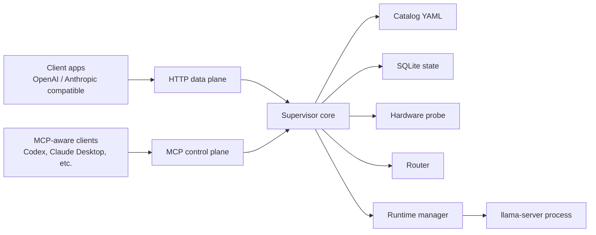
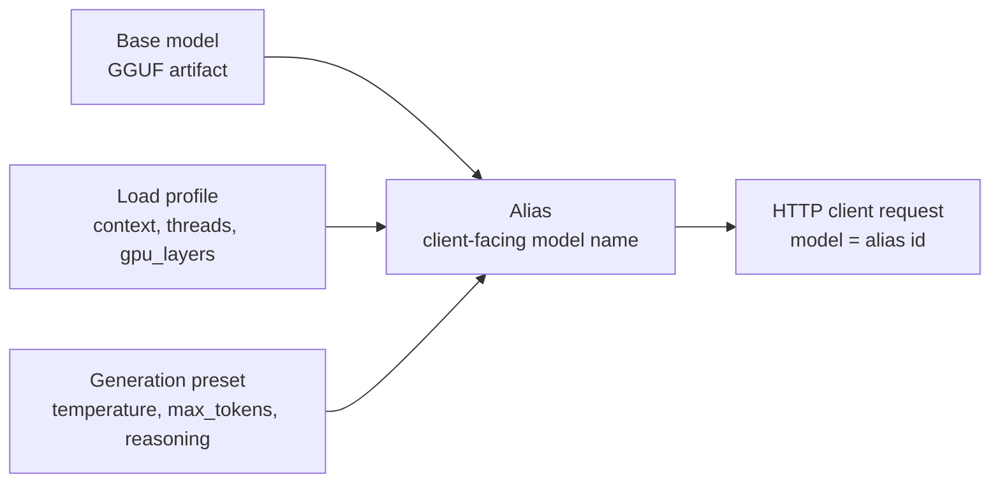

# Llama.cpp MCP


> Run local `llama.cpp` models behind a clean compatibility layer with two coordinated surfaces:
>
> - an **HTTP data plane** for OpenAI-style and Anthropic-style inference
> - an **MCP control plane** for catalog management, routing, diagnostics, and benchmarking

> [!IMPORTANT]
> **Inference goes through HTTP only.** MCP is the management/control plane. It does not serve normal completions.

## Overview

`llama.cpp` is excellent at local inference, but modern coding tools and agents usually expect hosted-model APIs.
This project closes that gap by supervising local GGUF models and exposing them through familiar interfaces.

## About This Repo

This repository is built to be practical first: a local MCP service that keeps model naming stable, routing explicit, and setup approachable for people who just want their local models to behave like a polished service.

If you are new here, the rough mental model is:

- one catalog file for models, profiles, presets, and aliases
- one HTTP server for inference traffic
- one MCP service for operating the system
- one local `llama.cpp` installation underneath it all

## Tech Stack

**Core runtime**

- `Python 3.12`
- `FastAPI`
- `Uvicorn`
- `MCP SDK`
- `Pydantic`

**Local systems**

- `llama-server`
- `llama-bench`
- `psutil`
- `httpx`
- `PyYAML`

**Storage and config**

- `catalog/catalog.yaml`
- `state/mcp.db`
- environment variables

With this server, you can:

- call local models through OpenAI-compatible endpoints
- call local models through Anthropic-compatible endpoints
- give models stable alias names instead of raw filesystem paths
- lazily load runtimes on first use and reuse warm runtimes automatically
- unload idle runtimes and pin important ones
- route requests using CPU, dGPU, iGPU, and benchmark evidence
- manage the whole system through MCP tools instead of hand-editing internal state

### Highlights

- :rocket: Familiar HTTP APIs for local inference
- :toolbox: MCP tools for operating the whole stack
- :zap: Lazy load, warm reuse, and idle unload
- :compass: Routing informed by hardware state and benchmarks

## Figure 1: System View



## Contents

- [What You Need](#what-you-need)
- [Commands You Will Use](#commands-you-will-use)
- [Windows Installation](#windows-installation-powershell)
- [Linux Installation](#linux-installation-bash)
- [Minimal Working Catalog](#minimal-working-catalog)
- [Practical Use Cases](#practical-use-cases)
- [Features and Specs](#features-and-specs)
- [Environment Variables](#environment-variables)
- [Current Limitations](#current-limitations)
- [Detailed Design Spec](#detailed-design-spec)

## What You Need

The Python package is only one part of the setup. A working installation also needs local `llama.cpp` binaries and at least one GGUF model.

| Requirement | Required | Why it matters |
| --- | --- | --- |
| Python 3.12+ | Yes | Required by this package |
| `uv` | Recommended | Simplest way to install and run the project |
| `llama-server` | Yes | The MCP server launches it for inference |
| `llama-bench` | Optional | Enables benchmark collection and benchmark-aware routing evidence |
| One or more `.gguf` files | Yes | These are the actual models you will serve |
| `nvidia-smi` | Optional | Improves NVIDIA GPU discovery |
| Separate backend-specific binaries | Recommended | Gives more accurate backend detection and routing |

> [!TIP]
> `init-config` gives you a starter catalog, but the catalog is intentionally empty of real models. You still need to add at least one model and alias before `/v1/models` becomes useful.

### External Dependencies at a Glance

- **Bundled by Python install**: FastAPI, Uvicorn, MCP SDK, `httpx`, `psutil`, `PyYAML`, `pydantic`
- **Not bundled**: `llama.cpp` binaries and model files
- **Optional but valuable**: backend-specific `llama-bench` binaries

## Commands You Will Use

| Command | What it does | When to use it |
| --- | --- | --- |
| `uv run llama-mcp init-config` | Writes a starter catalog file if one does not exist | First-time setup |
| `uv run llama-mcp validate-config` | Validates catalog references and local model paths | Before starting servers |
| `uv run llama-mcp http` | Starts the OpenAI/Anthropic-compatible HTTP server | For inference traffic |
| `uv run llama-mcp mcp` | Starts the MCP server over stdio | For admin/control-plane tools |

If you install the package as a normal script-based app, these entry points also exist:

- `llama-mcp`
- `llama-mcp-http`
- `llama-mcp-server`

## Windows Installation (PowerShell)

These steps are written for someone starting from scratch.

### 1. Install Python and `uv`

Install:

- [Python 3.12+](https://www.python.org/)
- [`uv`](https://docs.astral.sh/uv/)

Verify both are available:

```powershell
python --version
uv --version
```

### 2. Get `llama.cpp` binaries

You need at least one working `llama-server.exe`.
If you want routing and benchmarking to understand multiple backends cleanly, keep separate builds for CPU, CUDA, Vulkan, and/or SYCL.

This repo already auto-detects the following Windows paths when they exist:

```text
C:\llama.cpp\cpu\llama-server.exe
C:\llama.cpp\cuda13\llama-server.exe
C:\llama.cpp\cuda\llama-server.exe
C:\llama.cpp\vulkan\llama-server.exe
C:\llama.cpp\sycl\llama-server.exe

C:\llama.cpp\cpu\llama-bench.exe
C:\llama.cpp\cuda13\llama-bench.exe
C:\llama.cpp\cuda\llama-bench.exe
C:\llama.cpp\vulkan\llama-bench.exe
C:\llama.cpp\sycl\llama-bench.exe
```

You can also point to custom paths explicitly with environment variables in step 4.

### 3. Clone the repo and install Python dependencies

```powershell
# Clone the repository.
git clone <YOUR_REPO_URL>
cd llama-cpp-mcp

# Install runtime dependencies.
uv sync

# Optional: include test dependencies too.
# uv sync --extra test
```

### 4. Set environment variables

Use this if your binaries are not in the default Windows locations, or if you want the setup to be explicit and easy to debug.

```powershell
# Optional but recommended: lock the server to localhost + a known port.
$env:LLAMA_MCP_HOST = "127.0.0.1"
$env:LLAMA_MCP_PORT = "8080"

# Optional: protect the HTTP API with a key.
$env:LLAMA_MCP_API_KEY = "change-me"

# Point the MCP server to your catalog and state files.
$env:LLAMA_MCP_CATALOG_PATH = "$PWD\catalog\catalog.yaml"
$env:LLAMA_MCP_STATE_PATH = "$PWD\state\mcp.db"

# Point to the llama.cpp binaries you actually have.
$env:LLAMA_SERVER_CPU = "C:\llama.cpp\cpu\llama-server.exe"
$env:LLAMA_SERVER_CUDA = "C:\llama.cpp\cuda13\llama-server.exe"
$env:LLAMA_SERVER_VULKAN = "C:\llama.cpp\vulkan\llama-server.exe"
$env:LLAMA_SERVER_SYCL = "C:\llama.cpp\sycl\llama-server.exe"

# Optional benchmark binaries.
$env:LLAMA_BENCH_CPU = "C:\llama.cpp\cpu\llama-bench.exe"
$env:LLAMA_BENCH_CUDA = "C:\llama.cpp\cuda13\llama-bench.exe"
$env:LLAMA_BENCH_VULKAN = "C:\llama.cpp\vulkan\llama-bench.exe"
$env:LLAMA_BENCH_SYCL = "C:\llama.cpp\sycl\llama-bench.exe"
```

> [!NOTE]
> The `$env:...` commands above only affect the current PowerShell session. If you want them to persist, add them to your user or system environment variables.

### 5. Bootstrap the config

```powershell
uv run llama-mcp init-config
```

This creates a starter catalog if it does not already exist.

### 6. Add a real model and alias

Open `catalog/catalog.yaml` and replace the starter content with a real model definition. A copyable minimal example is in [Minimal Working Catalog](#minimal-working-catalog).

### 7. Validate the setup

```powershell
uv run llama-mcp validate-config
```

You should see:

```text
Configuration is valid.
```

### 8. Start the HTTP server

```powershell
uv run llama-mcp http
```

The default bind address is `127.0.0.1:8080`.

### 9. Start the MCP server in a second terminal

```powershell
uv run llama-mcp mcp
```

This starts the MCP server over **stdio**, which is the transport most desktop MCP clients expect.

### 10. Smoke test the HTTP surface

```powershell
# Health check.
Invoke-RestMethod -Uri "http://127.0.0.1:8080/health"

# List the aliases that clients can use.
Invoke-RestMethod -Uri "http://127.0.0.1:8080/v1/models" -Headers @{
  "Authorization" = "Bearer change-me"
}
```

If you did not set `LLAMA_MCP_API_KEY`, remove the `Authorization` header.

## Linux Installation (Bash)

### 1. Install Python and `uv`

Install:

- [Python 3.12+](https://www.python.org/)
- [`uv`](https://docs.astral.sh/uv/)

Verify both are available:

```bash
python3 --version
uv --version
```

### 2. Build or install `llama.cpp`

You need at least one `llama-server` binary.
If you want backend-aware routing and benchmarking to be predictable, keep explicit binaries for the backends you plan to use.

Typical examples:

```text
$HOME/llama.cpp/build-cpu/bin/llama-server
$HOME/llama.cpp/build-cuda/bin/llama-server
$HOME/llama.cpp/build-vulkan/bin/llama-server
$HOME/llama.cpp/build-sycl/bin/llama-server
```

and optionally:

```text
$HOME/llama.cpp/build-cpu/bin/llama-bench
$HOME/llama.cpp/build-cuda/bin/llama-bench
$HOME/llama.cpp/build-vulkan/bin/llama-bench
$HOME/llama.cpp/build-sycl/bin/llama-bench
```

### 3. Clone the repo and install Python dependencies

```bash
# Clone the repository.
git clone <YOUR_REPO_URL>
cd llama-cpp-mcp

# Install runtime dependencies.
uv sync

# Optional: include test dependencies too.
# uv sync --extra test
```

### 4. Export environment variables

```bash
# Optional but recommended: explicit host/port.
export LLAMA_MCP_HOST="127.0.0.1"
export LLAMA_MCP_PORT="8080"

# Optional: protect the HTTP API with a key.
export LLAMA_MCP_API_KEY="change-me"

# Explicit config paths.
export LLAMA_MCP_CATALOG_PATH="$PWD/catalog/catalog.yaml"
export LLAMA_MCP_STATE_PATH="$PWD/state/mcp.db"

# Backend-specific llama.cpp executables.
export LLAMA_SERVER_CPU="$HOME/llama.cpp/build-cpu/bin/llama-server"
export LLAMA_SERVER_CUDA="$HOME/llama.cpp/build-cuda/bin/llama-server"
export LLAMA_SERVER_VULKAN="$HOME/llama.cpp/build-vulkan/bin/llama-server"
export LLAMA_SERVER_SYCL="$HOME/llama.cpp/build-sycl/bin/llama-server"

# Optional benchmark executables.
export LLAMA_BENCH_CPU="$HOME/llama.cpp/build-cpu/bin/llama-bench"
export LLAMA_BENCH_CUDA="$HOME/llama.cpp/build-cuda/bin/llama-bench"
export LLAMA_BENCH_VULKAN="$HOME/llama.cpp/build-vulkan/bin/llama-bench"
export LLAMA_BENCH_SYCL="$HOME/llama.cpp/build-sycl/bin/llama-bench"
```

> [!TIP]
> On Linux, the HTTP server can still fall back to `llama-server` from `PATH` for runtime launch, but explicit `LLAMA_SERVER_*` variables make backend detection, routing, and troubleshooting much clearer.

### 5. Bootstrap the config

```bash
uv run llama-mcp init-config
```

### 6. Add a real model and alias

Open `catalog/catalog.yaml` and replace the starter content with a real model definition. A copyable minimal example is below.

### 7. Validate the setup

```bash
uv run llama-mcp validate-config
```

You should see:

```text
Configuration is valid.
```

### 8. Start the HTTP server

```bash
uv run llama-mcp http
```

### 9. Start the MCP server in another shell

```bash
uv run llama-mcp mcp
```

### 10. Smoke test the HTTP surface

```bash
# Health check.
curl http://127.0.0.1:8080/health

# List available aliases.
curl \
  -H "Authorization: Bearer change-me" \
  http://127.0.0.1:8080/v1/models
```

If you did not set `LLAMA_MCP_API_KEY`, omit the `Authorization` header.

## Minimal Working Catalog

This is the smallest realistic catalog that makes the server useful.
Replace the model path with a real `.gguf` file on your machine.

```yaml
# Actual GGUF model files live here.
models:
  - id: qwen3.5-0.8b
    display_name: Qwen 3.5 0.8B Instruct
    source: local
    local_path: /absolute/path/to/qwen3.5-0.8b-instruct-q8_0.gguf # On Windows, C:/models/... also works.
    family: qwen3.5
    quantization: Q8_0
    capabilities: [chat, completion, tools]
    size_bytes: 934000000
    estimated_ram_bytes: 2147483648
    estimated_vram_bytes: 1073741824

# Load profiles affect launch and placement decisions.
profiles:
  - id: balanced
    description: General-purpose profile with a moderate context window.
    context_size: 8192
    backend_preference: auto
    gpu_layers: 99

# Presets affect request-time defaults.
presets:
  - id: precise
    description: Low-temperature preset for coding and admin tasks.
    temperature: 0.1
    top_p: 0.9
    max_tokens: 1024
    reasoning_mode: off

# Aliases are the names clients actually send in API requests.
aliases:
  - id: qwen3.5-0.8b/precise-auto
    base_model_id: qwen3.5-0.8b
    load_profile_id: balanced
    preset_id: precise
    capabilities: [chat, completion, tools]
```

> [!IMPORTANT]
> Clients send the **alias id**, not the base model id. In the example above, the usable client-facing model name is `qwen3.5-0.8b/precise-auto`.

## Figure 2: Catalog Relationships



## Practical Use Cases

These examples are intentionally commented so a new user can understand what is happening while copying them.

### 1. OpenAI-Compatible Chat Completion

```bash
# Ask the local model a question through the OpenAI-compatible surface.
# The model name must be an alias from catalog/catalog.yaml.
curl \
  -X POST http://127.0.0.1:8080/v1/chat/completions \
  -H "Content-Type: application/json" \
  -H "Authorization: Bearer change-me" \
  -d '{
    "model": "qwen3.5-0.8b/precise-auto",
    "messages": [
      {"role": "system", "content": "You are a concise coding assistant."},
      {"role": "user", "content": "Explain what lazy loading means in one paragraph."}
    ]
  }'
```

What happens behind the scenes:

- the server resolves the alias to a base model + profile + preset
- the router chooses a placement based on resources and policy
- if the runtime is not already warm, `llama-server` is launched automatically
- the request is proxied to that runtime and returned in OpenAI-compatible format

### 2. OpenAI Responses API with Tool Definitions

```bash
# Use the Responses-style endpoint.
# Internally, the server translates this into a chat-completions-style request.
curl \
  -X POST http://127.0.0.1:8080/v1/responses \
  -H "Content-Type: application/json" \
  -H "Authorization: Bearer change-me" \
  -d '{
    "model": "qwen3.5-0.8b/precise-auto",
    "instructions": "Answer clearly and call tools when needed.",
    "input": [
      {
        "type": "message",
        "role": "user",
        "content": [
          {"type": "input_text", "text": "What files are in the current project root?"}
        ]
      }
    ],
    "tools": [
      {
        "type": "function",
        "function": {
          "name": "list_files",
          "description": "List files in the current directory.",
          "parameters": {
            "type": "object",
            "properties": {}
          }
        }
      }
    ]
  }'
```

Good to know:

- `/v1/responses` is supported
- tool use is supported here
- typed `input` items such as `message`, `input_text`, `input_image`, and `input_file` are normalized into chat messages

### 3. Anthropic-Compatible Messages

```bash
# Use the Anthropic-compatible surface.
# The anthropic-version header is required.
curl \
  -X POST http://127.0.0.1:8080/v1/messages \
  -H "Content-Type: application/json" \
  -H "Authorization: Bearer change-me" \
  -H "anthropic-version: 2023-06-01" \
  -d '{
    "model": "qwen3.5-0.8b/precise-auto",
    "max_tokens": 256,
    "messages": [
      {"role": "user", "content": "Write three bullets about why local inference is useful."}
    ]
  }'
```

Good to know:

- `/v1/messages` is translated to the OpenAI-style chat format internally
- tool use is supported here too
- `/v1/messages/count_tokens` currently returns an approximate token count, not a tokenizer-perfect one

### 4. Use MCP to Import a Model and Create an Alias

The exact JSON-RPC envelope depends on your MCP client, but these are the tool names and arguments you will call.

**Import a local model**

```json
{
  "id": "qwen3.5-0.8b",
  "display_name": "Qwen 3.5 0.8B Instruct",
  "source": "local",
  "local_path": "/absolute/path/to/qwen3.5-0.8b-instruct-q8_0.gguf",
  "family": "qwen3.5",
  "quantization": "Q8_0",
  "capabilities": ["chat", "completion", "tools"]
}
```

Call it with the MCP tool name:

```text
llama_import_model
```

**Create an alias**

```json
{
  "id": "qwen3.5-0.8b/precise-auto",
  "base_model_id": "qwen3.5-0.8b",
  "load_profile_id": "balanced",
  "preset_id": "precise",
  "capabilities": ["chat", "completion", "tools"]
}
```

Call it with:

```text
llama_create_alias
```

### 5. Explain a Route Before Sending Real Traffic

This is one of the most useful operator workflows.
Ask MCP why a route was chosen before you benchmark or troubleshoot.

Tool name:

```text
llama_route_explain
```

Arguments:

```json
{
  "alias_id": "qwen3.5-0.8b/precise-auto"
}
```

You will get a response that summarizes:

- the selected backend
- the selected placement
- which candidates were rejected
- whether a warm runtime would be reused
- why the winning route scored best

## Features and Specs

### Core Product Surfaces

| Surface | Purpose | What it is for | What it is not for |
| --- | --- | --- | --- |
| HTTP data plane | Inference compatibility layer | Chat, completions, embeddings, responses, Anthropic messages, streaming | Editing the catalog, managing runtimes, benchmarking policy |
| MCP control plane | Operator/admin layer | Managing models, aliases, profiles, presets, diagnostics, routing, benchmarks, memory policy | General completion traffic |

### HTTP API Surface

| Endpoint | Status | Notes |
| --- | --- | --- |
| `GET /health` | Supported | Health and loaded runtime count |
| `GET /v1/models` | Supported | Lists aliases, not raw base models |
| `GET /v1/models/{model_id}` | Supported | Returns resolved alias information |
| `POST /v1/chat/completions` | Supported | OpenAI-compatible chat |
| `POST /v1/completions` | Supported | Legacy text completions only |
| `POST /v1/embeddings` | Supported | Proxied to `llama-server` embeddings |
| `POST /v1/responses` | Supported | Responses-style translation layer |
| `POST /v1/messages` | Supported | Anthropic-compatible messages |
| `POST /v1/messages/count_tokens` | Supported | Approximate token counting |

### Tool Use Support

| Endpoint | Tool use |
| --- | --- |
| `POST /v1/chat/completions` | Yes |
| `POST /v1/responses` | Yes |
| `POST /v1/messages` | Yes |
| `POST /v1/completions` | No |

### MCP Tool Groups

| Group | Representative tools |
| --- | --- |
| Catalog inspection | `llama_list_models`, `llama_get_model`, `llama_list_aliases`, `llama_get_alias` |
| Catalog mutation | `llama_import_model`, `llama_download_model`, `llama_create_profile`, `llama_create_preset`, `llama_create_alias` |
| Runtime operations | `llama_load_alias`, `llama_unload_alias`, `llama_unload_idle`, `llama_pin_alias`, `llama_get_runtime_status` |
| Routing and diagnostics | `llama_get_hardware`, `llama_route_explain`, `llama_route_simulate`, `llama_list_route_events`, `llama_get_runtime_diagnostics` |
| Benchmarking | `llama_run_benchmark`, `llama_record_benchmark`, `llama_verify_benchmark`, `llama_list_benchmarks`, `llama_benchmark_summary` |
| Policy | `llama_get_memory_policy`, `llama_set_memory_policy` |

### Routing and Placement

The router scores candidates using:

- current free system RAM
- free dGPU VRAM
- iGPU shared-memory policy
- backend availability
- backend preference
- warm runtime reuse
- stored benchmark evidence
- experimental feature flags

#### Placement Status

| Placement | Typical backend | Status |
| --- | --- | --- |
| `cpu_only` | CPU | Stable |
| `dgpu_only` | CUDA or Vulkan | Stable |
| `cpu_dgpu_hybrid` | CUDA | Stable |
| `igpu_only` | Vulkan or SYCL | Experimental |
| `cpu_igpu_hybrid` | Vulkan or SYCL | Experimental |
| `dgpu_igpu_mixed` | Vulkan | Experimental |

> [!NOTE]
> Experimental iGPU and mixed-GPU placements are disabled by default. Enable them explicitly with environment variables if you want the router to consider them.

### Runtime Lifecycle

| Behavior | What it means |
| --- | --- |
| Lazy load | A runtime is started only when an alias is first requested |
| Warm reuse | Matching runtimes are reused instead of relaunched |
| Idle unload | Non-pinned runtimes are unloaded after their idle timeout |
| Pinning | Important runtimes can be kept resident |
| Eviction | If the max loaded count is reached, the oldest non-pinned runtime is evicted first |

### Config and State Files

| File | Purpose |
| --- | --- |
| `catalog/catalog.yaml` | Human-edited catalog of models, profiles, presets, and aliases |
| `state/mcp.db` | SQLite database for route history, benchmark data, and operational state |
| [`SPEC.md`](SPEC.md) | More detailed product/design specification |

### Catalog Concepts

| Concept | Purpose | Typical fields |
| --- | --- | --- |
| Base model | Describes the actual GGUF artifact | `id`, `local_path`, `family`, `quantization`, `capabilities` |
| Load profile | Controls launch and placement behavior | `context_size`, `threads`, `gpu_layers`, `backend_preference`, `idle_unload_seconds` |
| Generation preset | Controls request defaults | `temperature`, `top_p`, `max_tokens`, `reasoning_mode` |
| Alias | The client-facing model name | `id`, `base_model_id`, `load_profile_id`, `preset_id` |

### Download Support

The MCP control plane can also download models:

- from a direct URL using `source: url` plus `metadata.url`
- from Hugging Face using `source: hugging_face` plus `hf_repo` and `hf_filename`

### Qwen Reasoning Notes

The server includes special request shaping for Qwen-family models:

- `reasoning_mode: off` can disable thinking behavior for Qwen/Qwen3.5 aliases
- Qwen 3.5 aliases use explicit `enable_thinking` request fields when needed
- older Qwen-family aliases may receive `/think` or `/no_think` system hints

## Environment Variables

### Core Server

| Variable | Default | Purpose |
| --- | --- | --- |
| `LLAMA_MCP_HOST` | `127.0.0.1` | HTTP bind host |
| `LLAMA_MCP_PORT` | `8080` | HTTP bind port |
| `LLAMA_MCP_API_KEY` | unset | Optional API key; accepted as `Authorization: Bearer ...` or `x-api-key` |
| `LLAMA_MCP_CATALOG_PATH` | `catalog/catalog.yaml` | Catalog file location |
| `LLAMA_MCP_STATE_PATH` | `state/mcp.db` | SQLite state file location |

### Runtime Behavior

| Variable | Default | Purpose |
| --- | --- | --- |
| `LLAMA_MCP_IDLE_SCAN_SECONDS` | `30` | How often to scan for idle runtimes |
| `LLAMA_MCP_RUNTIME_START_TIMEOUT` | `20` | Seconds to wait for a launched runtime to become healthy |
| `LLAMA_MCP_HTTP_TIMEOUT` | `120` | Upstream proxy timeout in seconds |
| `LLAMA_MCP_DEFAULT_IDLE_UNLOAD` | `900` | Default idle timeout for runtimes without a profile override |

### Memory and Routing Policy

| Variable | Default | Purpose |
| --- | --- | --- |
| `LLAMA_MCP_MIN_FREE_RAM` | `4 GiB` | Minimum free system RAM to keep after placement |
| `LLAMA_MCP_MIN_FREE_DGPU_VRAM` | `1 GiB` | Minimum free dGPU VRAM reserve |
| `LLAMA_MCP_MIN_FREE_IGPU_RAM` | `2 GiB` | Minimum shared RAM reserve for iGPU placements |
| `LLAMA_MCP_MAX_LOADED` | `4` | Max simultaneously loaded runtimes |
| `LLAMA_MCP_MAX_CONCURRENCY` | `4` | Max concurrent requests per runtime |
| `LLAMA_MCP_ALLOW_EXPERIMENTAL_IGPU` | `false` | Enables experimental iGPU placements |
| `LLAMA_MCP_ALLOW_EXPERIMENTAL_MIXED` | `false` | Enables experimental dGPU+iGPU mixed routing |

### `llama.cpp` Executables

| Variable | Purpose |
| --- | --- |
| `LLAMA_SERVER_CPU` | Path to CPU `llama-server` |
| `LLAMA_SERVER_CUDA` | Path to CUDA `llama-server` |
| `LLAMA_SERVER_VULKAN` | Path to Vulkan `llama-server` |
| `LLAMA_SERVER_SYCL` | Path to SYCL `llama-server` |
| `LLAMA_BENCH_CPU` | Path to CPU `llama-bench` |
| `LLAMA_BENCH_CUDA` | Path to CUDA `llama-bench` |
| `LLAMA_BENCH_VULKAN` | Path to Vulkan `llama-bench` |
| `LLAMA_BENCH_SYCL` | Path to SYCL `llama-bench` |

## Validation and Testing

### Validate config before startup

```bash
uv run llama-mcp validate-config
```

### Run tests

```bash
# Install the optional test dependencies first if needed.
uv sync --extra test
uv run pytest -q
```

## Current Limitations

- The project is still **alpha-stage**.
- MCP is a control plane only; it is not a general inference endpoint.
- `/v1/messages/count_tokens` is approximate.
- Mixed dGPU+iGPU routing is experimental and only trusted when benchmark evidence is verified.
- iGPU support is experimental.
- Backend detection is strongest when backend-specific executables are configured explicitly.
- The server supervises `llama.cpp`; it does not replace or reimplement upstream inference internals.

## Detailed Design Spec

For the deeper product and architecture breakdown, see [SPEC.md](SPEC.md).
