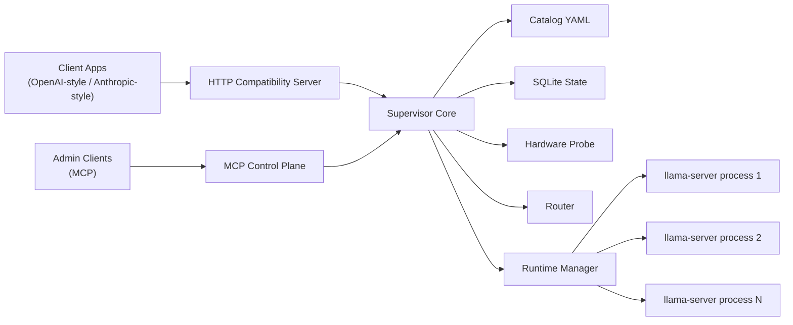

# Llama.cpp Orchestrator

Local orchestration and compatibility layer for `llama.cpp`.

This project gives you two coordinated surfaces over your local GGUF models:

- an HTTP data plane for inference
- an MCP control plane for management, diagnostics, and policy

Inference goes through HTTP only. MCP does not serve general model completions. MCP exists to configure the system, inspect it, benchmark it, and operate it.

## Goal

The goal of this project is to make local `llama.cpp` models usable from modern coding and agent tools that expect hosted-model APIs.

That means:

- OpenAI-compatible clients can talk to your local models
- Anthropic-compatible clients can talk to your local models
- coding tools can use stable alias names instead of raw file paths
- the server can lazily load, reuse, and unload models automatically
- routing decisions can consider CPU, dGPU, iGPU, mixed GPU paths, resource reserves, and benchmark history
- operators can manage the whole system through MCP instead of hand-editing internal state

## What This Project Is

This project is a supervisor around upstream `llama.cpp`, not a replacement for it.

It manages:

- model catalog and aliases
- load profiles and generation presets
- local `llama-server` subprocess lifecycle
- hardware discovery
- routing decisions
- benchmark collection
- OpenAI and Anthropic compatibility translation
- MCP-based administration

It does not reimplement inference internals.

## Core Design

There are two separate planes:

### Control Plane

The control plane is the MCP server.

Use it for:

- importing or deleting models
- creating and cloning profiles
- creating and cloning presets
- creating and updating aliases
- pinning and unloading runtimes
- setting memory policy
- running and verifying benchmarks
- inspecting hardware, routes, runtimes, and route history

Do not use it for normal generation.

### Data Plane

The data plane is the HTTP compatibility server.

Use it for:

- OpenAI-style chat
- OpenAI-style responses
- embeddings
- Anthropic-style messages
- tool use through supported endpoints
- streaming

All inference traffic should go through the data plane.

## Key Features

- OpenAI-compatible HTTP endpoints
- Anthropic-compatible HTTP endpoints
- MCP control plane for administration
- named model aliases
- multi-model residency with configurable memory reserves
- lazy load on first use
- warm runtime reuse
- idle unload
- explicit pinning
- benchmark-aware routing
- CPU, dGPU, and experimental iGPU awareness
- experimental mixed dGPU+iGPU routing
- route explainability
- route history
- dependency-aware catalog lifecycle operations
- startup validation for broken local config
- starter catalog bootstrap for fresh installs

## Current Compatibility Scope

### OpenAI-Compatible Endpoints

- `GET /v1/models`
- `GET /v1/models/{model_id}`
- `POST /v1/chat/completions`
- `POST /v1/completions`
- `POST /v1/embeddings`
- `POST /v1/responses`

### Anthropic-Compatible Endpoints

- `GET /v1/models`
- `GET /v1/models/{model_id}`
- `POST /v1/messages`
- `POST /v1/messages/count_tokens`

### Tool Use

Tool use is supported on the compatible generation endpoints where it belongs:

- OpenAI `POST /v1/chat/completions`
- OpenAI `POST /v1/responses`
- Anthropic `POST /v1/messages`

Legacy `POST /v1/completions` is intentionally text-only and returns a clear compatibility error if tool fields are provided.

## Architecture



### Main Components

#### Catalog

The catalog is editable YAML that defines:

- base models
- load profiles
- generation presets
- aliases

#### State Store

The state store is SQLite and tracks:

- benchmarks
- route history
- verification metadata
- runtime-related operational state

#### Hardware Probe

The hardware probe collects:

- CPU count
- free/total RAM
- dGPU inventory
- iGPU inventory
- available backends
- backend selector metadata such as `cuda0` and `vulkan1`

#### Router

The router chooses a placement using:

- fit checks
- reserve policy
- backend availability
- warm runtime reuse
- benchmark evidence
- backend preference
- experimental placement gating

#### Runtime Manager

The runtime manager:

- launches `llama-server`
- health-checks it
- reuses warm instances
- unloads idle instances
- evicts when needed
- pins when requested

## Catalog Concepts

The system intentionally separates four concepts.

### Base Model

A base model describes the actual GGUF artifact.

Typical fields:

- `id`
- `display_name`
- `source`
- `local_path`
- `family`
- `quantization`
- `capabilities`
- `size_bytes`
- `estimated_ram_bytes`
- `estimated_vram_bytes`

### Load Profile

A load profile describes settings that may affect runtime loading and placement.

Typical fields:

- `context_size`
- `threads`
- `batch_size`
- `ubatch_size`
- `backend_preference`
- `gpu_layers`
- `tensor_split`
- `flash_attention`
- `embedding_mode`
- `idle_unload_seconds`

### Generation Preset

A preset describes request-time defaults.

Typical fields:

- `temperature`
- `top_p`
- `top_k`
- `repeat_penalty`
- `max_tokens`
- `stop`
- `grammar`
- `reasoning_mode`

### Alias

An alias is the client-facing model name.

Examples:

- `qwen3.5-0.8b/precise-auto`
- `qwen3.5-0.8b/precise-cpu`
- `my-coder/fast`

An alias resolves to:

- one base model
- one load profile
- one generation preset

This is the `model` string clients see and use.

## Routing Model

The router currently considers placements such as:

- `cpu_only`
- `dgpu_only`
- `igpu_only`
- `cpu_dgpu_hybrid`
- `cpu_igpu_hybrid`
- `dgpu_igpu_mixed`

### Stability Levels

Stable:

- `cpu_only`
- `dgpu_only`
- `cpu_dgpu_hybrid`

Experimental:

- `igpu_only`
- `cpu_igpu_hybrid`
- `dgpu_igpu_mixed`

### Important Note on Mixed GPU Routing

Mixed dGPU+iGPU routing exists from the beginning, but it is treated conservatively.

If benchmark evidence does not clearly prove a true mixed-device run, the router will not treat the path as strongly validated. For example, if `llama-bench` reports separate per-device rows instead of a clearly combined run, the result is recorded as unverified.

## Memory Policy

The server supports adjustable reserve buffers so local models do not consume the whole machine.

Main policy fields:

- `min_free_system_ram_bytes`
- `min_free_dgpu_vram_bytes`
- `min_free_igpu_shared_ram_bytes`
- `max_loaded_instances`
- `max_concurrent_requests_per_runtime`
- `allow_experimental_igpu`
- `allow_experimental_mixed_gpu`

These can be controlled through environment variables or the MCP control plane.

## Runtime Lifecycle

### Lazy Load

Models are only loaded when first needed, unless explicitly prewarmed.

### Warm Reuse

Compatible requests reuse already-running `llama-server` instances.

### Idle Unload

Idle runtimes are unloaded after their configured timeout.

### Pinning

Pinned runtimes are protected from normal idle eviction.

### Safe Deletion

Catalog lifecycle operations are dependency-aware:

- models cannot be deleted while aliases still reference them
- profiles cannot be deleted while aliases still reference them
- presets cannot be deleted while aliases still reference them
- aliases unload live runtimes before deletion

## Packaging and Deployment

The package is installable as a normal Python project and now includes:

- package metadata
- script entry points
- a unified CLI
- a starter catalog template
- startup config validation

### CLI Commands

- `llama-orchestrator http`
- `llama-orchestrator mcp`
- `llama-orchestrator init-config`
- `llama-orchestrator validate-config`

### Why `init-config` Exists

On a fresh machine, you often want the project to create a usable starter catalog before you customize it. The `init-config` command writes that starter file for you.

### Why `validate-config` Exists

Broken local catalogs are easy to create when model files move or aliases reference deleted objects. `validate-config` fails fast before the server starts serving traffic.

## Installation

### Requirements

- Python 3.12+
- `uv` recommended for dependency management
- a local `llama.cpp` build with `llama-server`
- optional `llama-bench` binaries for benchmark-aware routing

### Recommended Layout

You can use any layout, but the project expects a writable catalog path and state path.

Example:

- project install
- local GGUF models directory
- local `llama.cpp` executables

## Quick Start

### Windows

Install dependencies:

```powershell
uv sync
```

Bootstrap a starter catalog:

```powershell
uv run llama-orchestrator init-config
```

Validate your configuration:

```powershell
uv run llama-orchestrator validate-config
```

Start the HTTP server:

```powershell
uv run llama-orchestrator http
```

Start the MCP server:

```powershell
uv run llama-orchestrator mcp
```

### Linux

Install dependencies:

```bash
uv sync
```

Bootstrap a starter catalog:

```bash
uv run llama-orchestrator init-config
```

Validate your configuration:

```bash
uv run llama-orchestrator validate-config
```

Start the HTTP server:

```bash
uv run llama-orchestrator http
```

Start the MCP server:

```bash
uv run llama-orchestrator mcp
```

## Environment Variables

### Core Server

- `LLAMA_ORCH_HOST`
- `LLAMA_ORCH_PORT`
- `LLAMA_ORCH_API_KEY`
- `LLAMA_ORCH_CATALOG_PATH`
- `LLAMA_ORCH_STATE_PATH`

### Runtime Behavior

- `LLAMA_ORCH_IDLE_SCAN_SECONDS`
- `LLAMA_ORCH_RUNTIME_START_TIMEOUT`
- `LLAMA_ORCH_HTTP_TIMEOUT`
- `LLAMA_ORCH_DEFAULT_IDLE_UNLOAD`

### Memory Policy

- `LLAMA_ORCH_MIN_FREE_RAM`
- `LLAMA_ORCH_MIN_FREE_DGPU_VRAM`
- `LLAMA_ORCH_MIN_FREE_IGPU_RAM`
- `LLAMA_ORCH_MAX_LOADED`
- `LLAMA_ORCH_MAX_CONCURRENCY`
- `LLAMA_ORCH_ALLOW_EXPERIMENTAL_IGPU`
- `LLAMA_ORCH_ALLOW_EXPERIMENTAL_MIXED`

### Backend Executables

- `LLAMA_SERVER_CPU`
- `LLAMA_SERVER_CUDA`
- `LLAMA_SERVER_VULKAN`
- `LLAMA_SERVER_SYCL`

### Benchmark Executables

- `LLAMA_BENCH_CPU`
- `LLAMA_BENCH_CUDA`
- `LLAMA_BENCH_VULKAN`
- `LLAMA_BENCH_SYCL`

## Example Configuration

### Windows Example

```powershell
$env:LLAMA_ORCH_HOST = "127.0.0.1"
$env:LLAMA_ORCH_PORT = "8080"
$env:LLAMA_ORCH_CATALOG_PATH = "C:\llama-orchestrator\catalog\catalog.yaml"
$env:LLAMA_ORCH_STATE_PATH = "C:\llama-orchestrator\state\orchestrator.db"
$env:LLAMA_SERVER_CPU = "C:\llama.cpp\cpu\llama-server.exe"
$env:LLAMA_SERVER_CUDA = "C:\llama.cpp\cuda13\llama-server.exe"
$env:LLAMA_SERVER_VULKAN = "C:\llama.cpp\vulkan\llama-server.exe"
$env:LLAMA_BENCH_CPU = "C:\llama.cpp\cpu\llama-bench.exe"
$env:LLAMA_BENCH_CUDA = "C:\llama.cpp\cuda13\llama-bench.exe"
$env:LLAMA_BENCH_VULKAN = "C:\llama.cpp\vulkan\llama-bench.exe"
```

### Linux Example

```bash
export LLAMA_ORCH_HOST="127.0.0.1"
export LLAMA_ORCH_PORT="8080"
export LLAMA_ORCH_CATALOG_PATH="$HOME/.config/llama-orchestrator/catalog.yaml"
export LLAMA_ORCH_STATE_PATH="$HOME/.local/share/llama-orchestrator/orchestrator.db"
export LLAMA_SERVER_CPU="/opt/llama.cpp/cpu/llama-server"
export LLAMA_SERVER_CUDA="/opt/llama.cpp/cuda/llama-server"
export LLAMA_SERVER_VULKAN="/opt/llama.cpp/vulkan/llama-server"
export LLAMA_BENCH_CPU="/opt/llama.cpp/cpu/llama-bench"
export LLAMA_BENCH_CUDA="/opt/llama.cpp/cuda/llama-bench"
export LLAMA_BENCH_VULKAN="/opt/llama.cpp/vulkan/llama-bench"
```

## Catalog File Guide

The default catalog path is:

- `catalog/catalog.yaml`

The package can also bootstrap a starter catalog.

### Starter Example

```yaml
models: []
profiles:
  - id: balanced
    description: General-purpose profile with a moderate context window.
    context_size: 8192
    backend_preference: auto
    gpu_layers: 99
presets:
  - id: precise
    description: Low-temperature preset for reliable coding and admin tasks.
    temperature: 0.1
    top_p: 0.9
    max_tokens: 1024
    reasoning_mode: "off"
aliases: []
```

### Example Real Model Entry

```yaml
models:
  - id: qwen3.5-0.8b-q8
    display_name: Qwen3.5 0.8B Q8
    source: local
    local_path: C:\llama.cpp\models\Qwen3.5-0.8B-UD-Q8_K_XL.gguf
    family: qwen3.5
    quantization: Q8_K_XL
    size_bytes: 1175481600
    estimated_ram_bytes: 2147483648
    estimated_vram_bytes: 1073741824
```

### Example Alias Setup

```yaml
profiles:
  - id: cpu-safe
    context_size: 8192
    backend_preference: force_cpu
    threads: 8
  - id: auto-balanced
    context_size: 8192
    backend_preference: auto
    threads: 8
    gpu_layers: 99

presets:
  - id: precise
    temperature: 0.1
    top_p: 0.9
    max_tokens: 1024
    reasoning_mode: "off"

aliases:
  - id: qwen3.5-0.8b/precise-cpu
    base_model_id: qwen3.5-0.8b-q8
    load_profile_id: cpu-safe
    preset_id: precise
  - id: qwen3.5-0.8b/precise-auto
    base_model_id: qwen3.5-0.8b-q8
    load_profile_id: auto-balanced
    preset_id: precise
```

## User Guide

### 1. Bootstrap a New Machine

#### Windows

```powershell
uv sync
uv run llama-orchestrator init-config
notepad .\catalog\catalog.yaml
uv run llama-orchestrator validate-config
```

#### Linux

```bash
uv sync
uv run llama-orchestrator init-config
$EDITOR ./catalog/catalog.yaml
uv run llama-orchestrator validate-config
```

### 2. Start the Servers

#### HTTP

Windows:

```powershell
uv run llama-orchestrator http
```

Linux:

```bash
uv run llama-orchestrator http
```

#### MCP

Windows:

```powershell
uv run llama-orchestrator mcp
```

Linux:

```bash
uv run llama-orchestrator mcp
```

### 3. Use It as an OpenAI-Compatible Server

List models:

#### Windows PowerShell

```powershell
Invoke-RestMethod -Method Get -Uri "http://127.0.0.1:8080/v1/models"
```

#### Linux

```bash
curl http://127.0.0.1:8080/v1/models
```

Chat completion:

#### Windows PowerShell

```powershell
$body = @{
  model = "qwen3.5-0.8b/precise-auto"
  messages = @(
    @{ role = "user"; content = "Reply with exactly HELLO and nothing else." }
  )
  max_tokens = 8
} | ConvertTo-Json -Depth 10

Invoke-RestMethod -Method Post -Uri "http://127.0.0.1:8080/v1/chat/completions" -ContentType "application/json" -Body $body
```

#### Linux

```bash
curl http://127.0.0.1:8080/v1/chat/completions \
  -H "Content-Type: application/json" \
  -d '{
    "model": "qwen3.5-0.8b/precise-auto",
    "messages": [{"role":"user","content":"Reply with exactly HELLO and nothing else."}],
    "max_tokens": 8
  }'
```

### 4. Use It as an OpenAI Responses API

#### Windows PowerShell

```powershell
$body = @{
  model = "qwen3.5-0.8b/precise-cpu"
  instructions = "Be concise."
  input = @(
    @{
      type = "message"
      role = "user"
      content = @(
        @{ type = "input_text"; text = "Reply with exactly OK and nothing else." }
      )
    }
  )
  max_output_tokens = 8
} | ConvertTo-Json -Depth 20

Invoke-RestMethod -Method Post -Uri "http://127.0.0.1:8080/v1/responses" -ContentType "application/json" -Body $body
```

#### Linux

```bash
curl http://127.0.0.1:8080/v1/responses \
  -H "Content-Type: application/json" \
  -d '{
    "model": "qwen3.5-0.8b/precise-cpu",
    "instructions": "Be concise.",
    "input": [
      {
        "type": "message",
        "role": "user",
        "content": [{"type":"input_text","text":"Reply with exactly OK and nothing else."}]
      }
    ],
    "max_output_tokens": 8
  }'
```

### 5. Use It as an Anthropic-Compatible Server

#### Windows PowerShell

```powershell
$headers = @{
  "Content-Type" = "application/json"
  "anthropic-version" = "2023-06-01"
}

$body = @{
  model = "qwen3.5-0.8b/precise-cpu"
  max_tokens = 8
  messages = @(
    @{
      role = "user"
      content = @(
        @{ type = "text"; text = "Reply with exactly HI and nothing else." }
      )
    }
  )
} | ConvertTo-Json -Depth 20

Invoke-RestMethod -Method Post -Uri "http://127.0.0.1:8080/v1/messages" -Headers $headers -Body $body
```

#### Linux

```bash
curl http://127.0.0.1:8080/v1/messages \
  -H "Content-Type: application/json" \
  -H "anthropic-version: 2023-06-01" \
  -d '{
    "model": "qwen3.5-0.8b/precise-cpu",
    "max_tokens": 8,
    "messages": [
      {
        "role": "user",
        "content": [{"type":"text","text":"Reply with exactly HI and nothing else."}]
      }
    ]
  }'
```

### 6. Use Tool Calling

OpenAI-style chat example:

```json
{
  "model": "qwen3.5-0.8b/precise-auto",
  "messages": [{"role":"user","content":"Call the weather tool for Kuala Lumpur."}],
  "tools": [
    {
      "type": "function",
      "function": {
        "name": "get_weather",
        "description": "Get weather",
        "parameters": {
          "type": "object",
          "properties": {
            "location": {"type": "string"}
          },
          "required": ["location"]
        }
      }
    }
  ]
}
```

Anthropic-style tool example:

```json
{
  "model": "qwen3.5-0.8b/precise-auto",
  "max_tokens": 256,
  "messages": [
    {
      "role": "user",
      "content": [{"type":"text","text":"Call the weather tool for Kuala Lumpur."}]
    }
  ],
  "tools": [
    {
      "name": "get_weather",
      "description": "Get weather",
      "input_schema": {
        "type": "object",
        "properties": {
          "location": {"type": "string"}
        },
        "required": ["location"]
      }
    }
  ]
}
```

## MCP User Guide

The MCP server is meant for operators, not inference clients.

### Main MCP Tool Groups

#### Catalog Tools

- `llama_list_models`
- `llama_get_model`
- `llama_import_model`
- `llama_delete_model`
- `llama_list_profiles`
- `llama_get_profile`
- `llama_create_profile`
- `llama_update_profile`
- `llama_clone_profile`
- `llama_delete_profile`
- `llama_list_presets`
- `llama_get_preset`
- `llama_create_preset`
- `llama_update_preset`
- `llama_clone_preset`
- `llama_delete_preset`
- `llama_list_aliases`
- `llama_get_alias`
- `llama_create_alias`
- `llama_update_alias`
- `llama_delete_alias`

#### Runtime Tools

- `llama_get_runtime_status`
- `llama_get_runtime_diagnostics`
- `llama_load_alias`
- `llama_unload_alias`
- `llama_unload_idle`
- `llama_pin_alias`

#### Policy Tools

- `llama_get_memory_policy`
- `llama_set_memory_policy`

#### Benchmark and Routing Tools

- `llama_run_benchmark`
- `llama_record_benchmark`
- `llama_list_benchmarks`
- `llama_benchmark_summary`
- `llama_verify_benchmark`
- `llama_delete_benchmark`
- `llama_route_explain`
- `llama_route_simulate`
- `llama_list_route_events`

#### Hardware Tools

- `llama_get_hardware`

### Common MCP Workflows

#### Import a Local Model

Conceptually:

1. call `llama_import_model`
2. create or reuse a profile
3. create or reuse a preset
4. create an alias

#### Clone a Profile

Use `llama_clone_profile` when you want a profile that is mostly the same as an existing one but with a few overrides.

Example intent:

- clone `balanced` into `balanced-long`
- override `context_size`

#### Clone a Preset

Use `llama_clone_preset` when you want a small variant of a preset.

Example intent:

- clone `precise` into `creative`
- override `temperature`

#### Explain a Route

Use `llama_route_explain` to see:

- selected backend
- selected placement
- selected devices
- ranked rejected candidates
- why the winner was selected
- whether a warm runtime would be reused

#### Verify a Benchmark

Use `llama_verify_benchmark` when you manually confirm that a benchmark really represents a trustworthy placement, especially for experimental mixed GPU paths.

## Deployment Guide

### Local Developer Run

This is the simplest mode:

1. set environment variables
2. bootstrap catalog
3. validate config
4. start HTTP and MCP processes

### Windows Service or Scheduled Startup

Typical pattern:

1. set environment variables in a startup script
2. run `llama-orchestrator validate-config`
3. start `llama-orchestrator http`
4. optionally start `llama-orchestrator mcp`

### Linux Service Manager

Typical pattern:

1. export environment variables in a systemd unit or wrapper script
2. run `llama-orchestrator validate-config`
3. launch `llama-orchestrator http`

If you run MCP separately, launch `llama-orchestrator mcp` under a second unit or process supervisor.

## Validation and Testing

Run the test suite:

### Windows

```powershell
uv run pytest -q
```

### Linux

```bash
uv run pytest -q
```

The current project includes tests for:

- catalog validation
- startup validation
- routing decisions
- runtime reuse and idle unload
- benchmark parsing and verification
- OpenAI compatibility translation
- Anthropic compatibility translation
- streaming event translation
- MCP summary helpers

## Operational Notes

### Backend IDs

The hardware inventory uses:

- generic ids like `dgpu0`, `igpu0`
- backend selectors like `cuda0`, `vulkan0`, `vulkan1`

This makes the system more portable across machines and multi-GPU setups.

### Qwen Reasoning Behavior

The orchestrator already contains model-family-specific handling for Qwen-family reasoning modes. It uses server-side reasoning controls when supported and falls back to request shaping where appropriate.

### Experimental Paths

Experimental routes are visible on purpose. They are not hidden, but they are marked as experimental and scored conservatively until benchmark evidence supports them.

## Known Limitations

- Mixed GPU execution remains experimental
- some advanced multimodal block types are still normalized into placeholders
- token counting for Anthropic compatibility is still approximate
- not every `llama.cpp` backend combination is guaranteed to behave the same across vendors and drivers

## Recommended First Steps for New Users

1. install dependencies
2. run `llama-orchestrator init-config`
3. add one local model to the catalog
4. run `llama-orchestrator validate-config`
5. start the HTTP server
6. confirm `GET /v1/models`
7. send one OpenAI-style chat request
8. send one Anthropic-style message request
9. run `llama_get_hardware`
10. run `llama_route_explain`

## Project Status

This project is already usable for local development and coding workflows, but it is still evolving. The architecture is intentionally designed to be robust enough for daily local use while leaving room for more compatibility polish and deeper backend validation over time.
